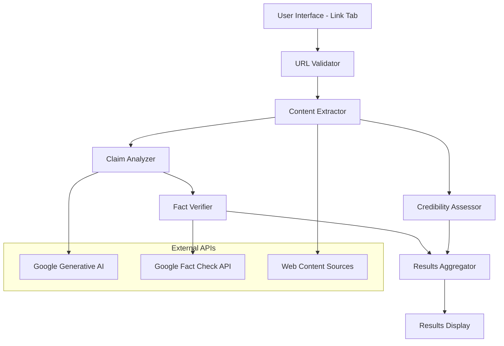

# Design Document: Link Content Verification

## Overview

The Link Content Verification feature extends the existing fact-checking website with URL-based content analysis. Users submit URLs through a new tab interface, and the system fetches, parses, and analyzes web content to extract factual claims and assess source credibility. The feature integrates seamlessly with the existing Next.js App Router architecture, Google AI APIs, and Shadcn/ui component system.

The design follows a modular approach with clear separation between URL validation, content extraction, claim analysis, and credibility assessment. All components maintain consistency with existing patterns while introducing new capabilities for web content processing.

## Architecture

### High-Level Architecture



### Component Architecture

The system follows a pipeline architecture where each component has a specific responsibility:

1. **URL Validator**: Sanitizes and validates user input
2. **Content Extractor**: Fetches and parses web content
3. **Claim Analyzer**: Identifies factual claims using AI
4. **Fact Verifier**: Checks claims against fact-checking databases
5. **Credibility Assessor**: Evaluates source reliability
6. **Results Aggregator**: Combines all analysis results
7. **Results Display**: Presents findings to users

### Integration Points

- **Existing Tab System**: New link verification tab integrates with current tabbed interface
- **Google AI Integration**: Leverages existing Gemini API configuration for claim analysis
- **Fact Check API**: Uses existing Google Fact Check API setup for verification
- **UI Components**: Extends existing Shadcn/ui component library
- **API Routes**: Follows established App Router patterns in `app/api/`

## Components and Interfaces

### Frontend Components

#### LinkVerificationTab Component
```typescript
interface LinkVerificationTabProps {
  isActive: boolean;
  onTabChange: (tab: string) => void;
}

interface LinkVerificationState {
  url: string;
  isLoading: boolean;
  results: VerificationResult | null;
  error: string | null;
  progress: VerificationProgress;
}
```

**Responsibilities:**
- Renders URL input form with validation
- Manages verification state and progress
- Displays results and error messages
- Integrates with existing tab navigation

#### URLInput Component
```typescript
interface URLInputProps {
  value: string;
  onChange: (url: string) => void;
  onSubmit: (url: string) => void;
  isLoading: boolean;
  error?: string;
}
```

**Responsibilities:**
- Provides URL input field with validation
- Shows real-time validation feedback
- Handles form submission
- Displays loading states

#### VerificationResults Component
```typescript
interface VerificationResultsProps {
  results: VerificationResult;
  onClear: () => void;
}
```

**Responsibilities:**
- Displays extracted claims and fact-check results
- Shows source credibility assessment
- Provides expandable sections for detailed information
- Includes action buttons for sharing or saving results

### Backend API Components

#### Link Verification API Route
**Path:** `app/api/link-verification/route.ts`

```typescript
interface LinkVerificationRequest {
  url: string;
}

interface LinkVerificationResponse {
  success: boolean;
  data?: VerificationResult;
  error?: string;
}
```

**Responsibilities:**
- Validates incoming URL requests
- Orchestrates the verification pipeline
- Returns structured results or error responses
- Handles rate limiting and error cases

#### Content Extraction Service
```typescript
interface ContentExtractionService {
  extractContent(url: string): Promise<WebContent>;
  parseMetadata(html: string): SourceMetadata;
  sanitizeContent(content: string): string;
}
```

**Responsibilities:**
- Fetches web page content using appropriate methods
- Parses HTML and extracts text content
- Handles various content types and formats
- Manages timeouts and error conditions

#### Claim Analysis Service
```typescript
interface ClaimAnalysisService {
  analyzeClaims(content: WebContent): Promise<ExtractedClaim[]>;
  prioritizeClaims(claims: ExtractedClaim[]): ExtractedClaim[];
  formatClaimsForVerification(claims: ExtractedClaim[]): string[];
}
```

**Responsibilities:**
- Uses Google Generative AI to identify factual claims
- Filters out opinions and subjective statements
- Prioritizes claims by importance and verifiability
- Formats claims for fact-checking APIs

#### Credibility Assessment Service
```typescript
interface CredibilityAssessmentService {
  assessSource(metadata: SourceMetadata): Promise<CredibilityScore>;
  evaluateDomain(domain: string): Promise<DomainReputation>;
  calculateOverallScore(factors: CredibilityFactor[]): number;
}
```

**Responsibilities:**
- Evaluates source domain reputation
- Considers publication standards and history
- Calculates credibility scores with explanations
- Provides transparent assessment criteria

## Data Models

### Core Data Types

#### WebContent
```typescript
interface WebContent {
  url: string;
  title: string;
  content: string;
  metadata: SourceMetadata;
  extractedAt: Date;
  contentType: 'article' | 'blog' | 'social' | 'news' | 'other';
}
```

#### SourceMetadata
```typescript
interface SourceMetadata {
  domain: string;
  title: string;
  author?: string;
  publishedDate?: Date;
  description?: string;
  language?: string;
  canonicalUrl?: string;
  socialMetadata?: {
    ogTitle?: string;
    ogDescription?: string;
    ogImage?: string;
  };
}
```

#### ExtractedClaim
```typescript
interface ExtractedClaim {
  id: string;
  text: string;
  context: string;
  confidence: number;
  category: 'factual' | 'statistical' | 'historical' | 'scientific' | 'other';
  position: {
    start: number;
    end: number;
  };
}
```

#### FactCheckResult
```typescript
interface FactCheckResult {
  claim: string;
  verdict: 'true' | 'false' | 'mixed' | 'unverified';
  explanation: string;
  sources: FactCheckSource[];
  confidence: number;
}

interface FactCheckSource {
  publisher: string;
  url: string;
  title: string;
  verdict: string;
  publishedDate?: Date;
}
```

#### CredibilityScore
```typescript
interface CredibilityScore {
  overall: number; // 0-100
  factors: CredibilityFactor[];
  explanation: string;
  lastUpdated: Date;
}

interface CredibilityFactor {
  name: string;
  score: number;
  weight: number;
  description: string;
}
```

#### VerificationResult
```typescript
interface VerificationResult {
  url: string;
  webContent: WebContent;
  extractedClaims: ExtractedClaim[];
  factCheckResults: FactCheckResult[];
  credibilityScore: CredibilityScore;
  processingTime: number;
  timestamp: Date;
}
```

### State Management

#### Verification Progress
```typescript
interface VerificationProgress {
  stage: 'validating' | 'fetching' | 'extracting' | 'analyzing' | 'verifying' | 'complete';
  percentage: number;
  message: string;
  estimatedTimeRemaining?: number;
}
```

#### Error Types
```typescript
type VerificationError = 
  | 'invalid_url'
  | 'fetch_failed'
  | 'parse_error'
  | 'analysis_failed'
  | 'api_error'
  | 'timeout'
  | 'rate_limited';

interface VerificationErrorDetails {
  type: VerificationError;
  message: string;
  retryable: boolean;
  suggestedAction?: string;
}
```

Now I need to use the prework tool to analyze the acceptance criteria before writing the Correctness Properties section.
## Correctness Properties

*A property is a characteristic or behavior that should hold true across all valid executions of a system—essentially, a formal statement about what the system should do. Properties serve as the bridge between human-readable specifications and machine-verifiable correctness guarantees.*

Based on the prework analysis of acceptance criteria, the following properties ensure the correctness of the Link Content Verification system:

### Property 1: URL Validation Completeness
*For any* string input, the URL validator should correctly classify it as either valid (HTTP/HTTPS format, accessible) or invalid, and valid URLs should proceed to processing while invalid URLs should return descriptive error messages without processing.
**Validates: Requirements 1.1, 1.2, 1.4**

### Property 2: Content Extraction Consistency  
*For any* valid and accessible URL, the content extractor should successfully retrieve web content and parse it into the expected WebContent structure with text, metadata, and source information.
**Validates: Requirements 2.1, 2.2, 2.4, 2.5**

### Property 3: Error Handling Robustness
*For any* error condition (network failures, parsing errors, API limits, timeouts), the system should return appropriate user-friendly error messages and never crash or hang indefinitely.
**Validates: Requirements 2.3, 7.1, 7.2, 7.3, 8.3**

### Property 4: Claim Analysis Accuracy
*For any* web content, the claim analyzer should identify factual claims (not opinions), structure them properly with context, and prioritize them by significance and verifiability.
**Validates: Requirements 3.1, 3.2, 3.3, 3.4, 3.5**

### Property 5: Fact Verification Integration
*For any* extracted claim, the system should submit it to the fact-check API and properly format the results with verdicts, sources, and explanations, handling cases where no fact-check data exists.
**Validates: Requirements 4.1, 4.2, 4.3, 4.4, 4.5**

### Property 6: Credibility Assessment Transparency
*For any* source domain, the credibility assessor should calculate a score based on defined factors and provide transparent explanations, properly handling cases where credibility cannot be determined.
**Validates: Requirements 5.1, 5.2, 5.3, 5.4, 5.5**

### Property 7: State Management Consistency
*For any* user interaction (tab switching, processing states, completion), the system should maintain appropriate state, preserve user data when needed, and provide clear progress indicators throughout the verification process.
**Validates: Requirements 6.3, 7.4, 7.5, 8.2**

### Property 8: Caching Behavior
*For any* URL that has been previously processed, submitting the same URL again should return cached results rather than re-processing, improving performance for repeated submissions.
**Validates: Requirements 8.5**

### Property 9: Theme Support Consistency
*For any* theme mode (light or dark), all link verification components should render properly and maintain visual consistency with the application's theme system.
**Validates: Requirements 6.4**

## Error Handling

### Error Classification and Recovery

The system implements comprehensive error handling across all components:

#### Network and Connectivity Errors
- **Timeout Handling**: All network requests implement configurable timeouts (default 10 seconds)
- **Retry Logic**: Transient network errors trigger exponential backoff retry (max 3 attempts)
- **Graceful Degradation**: Partial content extraction when full page access fails

#### Content Processing Errors
- **Parse Failures**: Invalid HTML or content structure handled with fallback text extraction
- **Encoding Issues**: Automatic charset detection and conversion for international content
- **Access Restrictions**: Paywall and authentication barriers handled gracefully

#### API Integration Errors
- **Rate Limiting**: Google API rate limits handled with user notification and retry suggestions
- **Service Unavailability**: Fallback messaging when external services are down
- **Invalid Responses**: Malformed API responses handled with appropriate error messages

#### User Input Errors
- **URL Validation**: Comprehensive validation with specific error messages for different failure types
- **Malformed Requests**: Client-side validation prevents invalid requests from reaching the server
- **Empty Results**: Clear messaging when no claims or fact-checks are found

### Error Response Format

All errors follow a consistent structure:

```typescript
interface ErrorResponse {
  success: false;
  error: {
    type: VerificationError;
    message: string;
    details?: string;
    retryable: boolean;
    suggestedAction?: string;
  };
}
```

## Testing Strategy

### Dual Testing Approach

The Link Content Verification feature requires both unit testing and property-based testing for comprehensive coverage:

#### Unit Testing Focus
- **Specific Examples**: Test known URLs with expected outcomes
- **Edge Cases**: Handle malformed URLs, empty content, network timeouts
- **Integration Points**: Verify API integrations with mocked responses
- **Error Conditions**: Test specific error scenarios and recovery paths
- **Component Interactions**: Verify UI component behavior and state management

#### Property-Based Testing Focus
- **Universal Properties**: Verify correctness properties across all inputs
- **Input Coverage**: Test with randomly generated URLs, content, and scenarios
- **Invariant Validation**: Ensure system invariants hold across all executions
- **Comprehensive Scenarios**: Cover edge cases through randomized testing

### Property-Based Test Configuration

- **Testing Library**: Use `fast-check` for TypeScript property-based testing
- **Minimum Iterations**: Each property test runs 100+ iterations for thorough coverage
- **Test Tagging**: Each test references its corresponding design property
- **Tag Format**: `// Feature: link-content-verification, Property {number}: {property_text}`

### Test Categories

#### Frontend Component Tests
- URL input validation and formatting
- Results display and interaction
- Tab integration and state management
- Theme switching and responsive behavior
- Loading states and progress indicators

#### Backend API Tests
- URL processing pipeline end-to-end
- Content extraction from various sources
- Claim analysis and prioritization
- Fact-checking API integration
- Credibility assessment calculations
- Error handling and recovery

#### Integration Tests
- Complete verification workflow
- External API interactions
- Caching behavior validation
- Performance and timeout handling
- Cross-browser compatibility

### Performance Testing

While not part of property-based testing, performance validation includes:
- **Load Testing**: Multiple concurrent URL verifications
- **Timeout Validation**: Ensure operations complete within specified timeframes
- **Memory Usage**: Monitor resource consumption during processing
- **Cache Effectiveness**: Validate caching improves performance for repeated requests

The testing strategy ensures both functional correctness through property-based testing and practical reliability through comprehensive unit and integration testing.